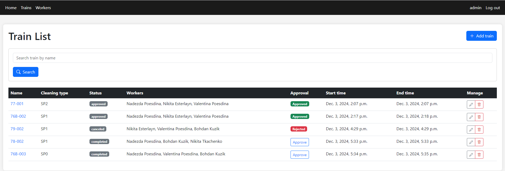

# Train Cleaning Management System


## Project Overview

**Train Cleaning Service** is a web-based application that allows you 
to manage and track train cleaning. The application provides 
access to add trains along with workers, establish the start of 
work and end of work, confirm the completed cleaning, and 
the up-to-date status depending on the stage. This service 
aims to help companies track in real time the progress of train 
cleaning and the process of confirmation by the checking position. 


---

## Project link

(https://train-cleaning-service.onrender.com)  

### Cleaner user:  
Login: `nikitosik`  
Password: `pythondjango`

### Auditor user:  
Login: `chek`  
Password: `pythondjango`

---

## Key Features

### 1. **User Management**
- **Roles:**  
  Users are assigned specific roles:
  - **Cleaner**: Responsible for cleaning trains.
  - **Auditor**: Reviews and approves cleaning tasks.
  - **Admin**: Manages the system but does not participate in operational tasks.
  
- **Role-Based Templates:**  
  Different roles have access to specific functionality.

### 2. **Train Management**
- **Statuses:**  
  Each train has a cleaning status:
  - `Awaits cleaning`
  - `Cleaning in progress`
  - `Cleaning completed`
  - `Cleaning approved`
  - `Cleaning canceled`
  
- **Cleaning Types:**  
  Trains have predefined cleaning types (e.g., SP0, SP1, SP2)
to categorize the level of cleaning required.

### 3. **Task Assignment**
- **Dynamic Worker Assignment:**  
  Everyone can assign cleaners to specific trains. 
Auditors and admins are excluded from operational task assignments.

- **Efficient Searching:**  
  Search trains by name to find one quickly.

### 4. **Approval Process**
- **Approval by Auditors:**  
  After the cleanup is marked as complete, the auditors 
review the engagement and either approve or reject it with 
optional comments.

- **Audit Trail:**  
  Approved or rejected tasks include timestamps and comments 
for accountability.

### 5. **Time Tracking**
- **Start and End Times:**  
  Tracks the start and end times of cleaning tasks to measure 
performance (this can be changed by anyone involved in the cleanup).

---

## Technical Details

### Tech Stack
- **Backend:** Django (Python)
- **Frontend:** HTML, CSS (Bootstrap), JavaScript
- **Database:** SQLite
- **Authentication:** Django's built-in authentication system

---

## How to Run the Project

### Prerequisites
- Python 3.x
- Virtualenv
- Django

### Installation Steps
   ```bash
    git clone https://github.com/pohgen/train-cleaning-system.git
    cd train-cleaning-system
    python -m venv venv
    source venv/bin/activate  # On Windows: venv\Scripts\activate
    pip install -r requirements.txt
    python manage.py migrate
    python manage.py runserver
   ```
Open your browser and navigate to http://127.0.0.1:8000/.

---

## Demo
[](demo.png)

---

## Contact
For questions or contributions, feel free to reach out:

- **Email**: sanyok.it@gmail.com
- **GitHub**: pohgen
